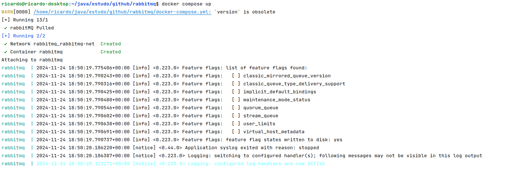

# RabbitMQ with Spring Boot 

# Getting Started

### Reference Documentation

For further reference, please consider the following sections:

* [Official Apache Maven documentation](https://maven.apache.org/guides/index.html)
* [Spring Boot Maven Plugin Reference Guide](https://docs.spring.io/spring-boot/3.4.0/maven-plugin)
* [Spring for RabbitMQ](https://docs.spring.io/spring-boot/3.4.0/reference/messaging/amqp.html)
* [Jersey](https://docs.spring.io/spring-boot/3.4.0/reference/web/servlet.html#web.servlet.jersey)
* [Spring Web](https://docs.spring.io/spring-boot/3.4.0/reference/web/servlet.html)

### Guides

The following guides illustrate how to use some features concretely:

* [Messaging with RabbitMQ](https://spring.io/guides/gs/messaging-rabbitmq/)
* [Building a RESTful Web Service](https://spring.io/guides/gs/rest-service/)
* [Serving Web Content with Spring MVC](https://spring.io/guides/gs/serving-web-content/)
* [Building REST services with Spring](https://spring.io/guides/tutorials/rest/)

### Details

##### Project structure:
````
rabbitmq
  src:
    main:
      java:
        br.com.rmcarvalhoo.rabbitmq:
          config: contem as classes de configurações da aplicacao.
          controller: São as classes que recebem e devolvem as requisiçoes
          dto: Entidades de transferencia de dados
          listener: classes que escutam as mensagens do rabbitmq
          RabbitmqApplication.java : start da aplicação 				
      resource:
        application.yml : configurações de acesso da aplicação
  .gitignore: Contem os arquivos que serão iginrados no versionamento
  pom.xml: Contem as dependencias da aplicação
  docker-compose.yml: Arquivo de configuração do docker
  Readme.md: Intruçoes iniciais desse projeto... vc esta nele :)
````

##### RabbitMQ:
Start: docker compose up


Console: http://localhost:15672/#/


##### Serviço:

```
curl --location --request POST 'http://localhost:8080/publisher/mail' \
--header 'Accept: application/json' \
--header 'Content-Type: application/json' \
--data-raw '{"subject":"Encontro de motos","recipient":"zedascoves@hotmail.com","content":"Vms andar de moto!!"}'
``` 


